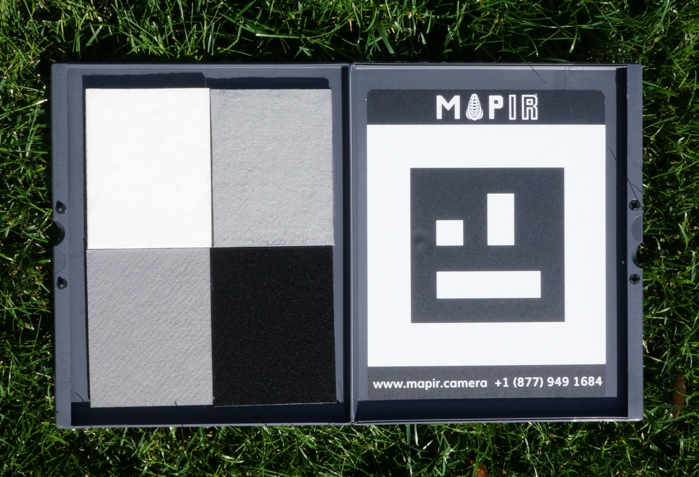
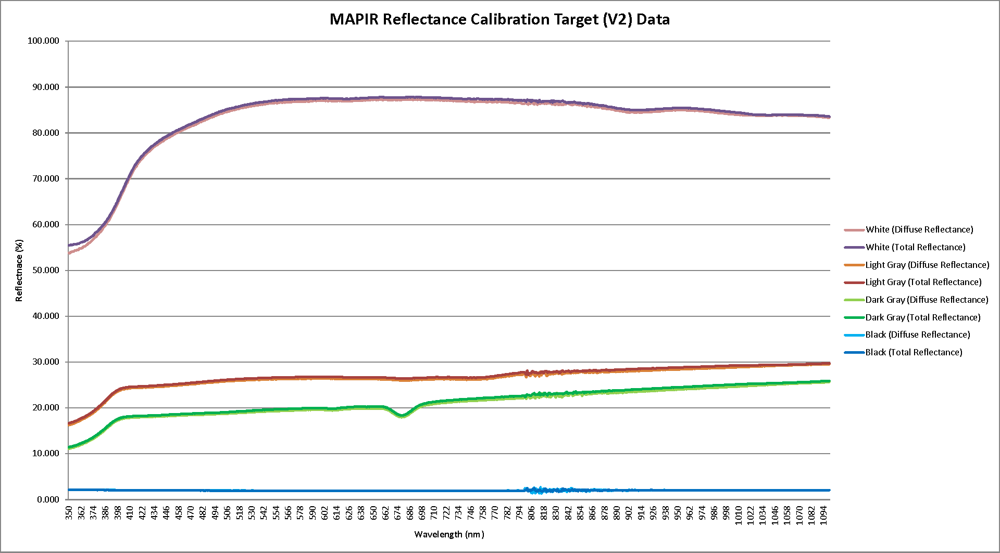
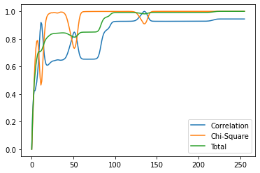
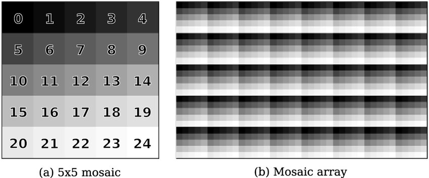
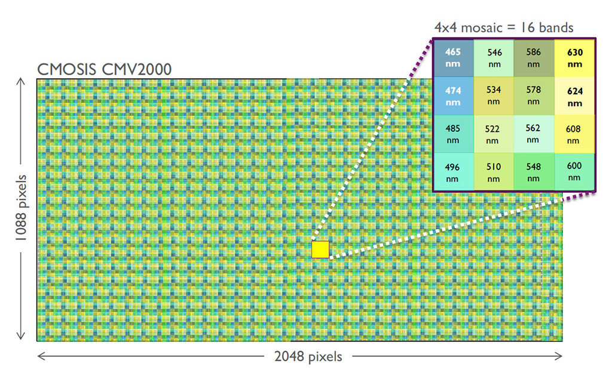
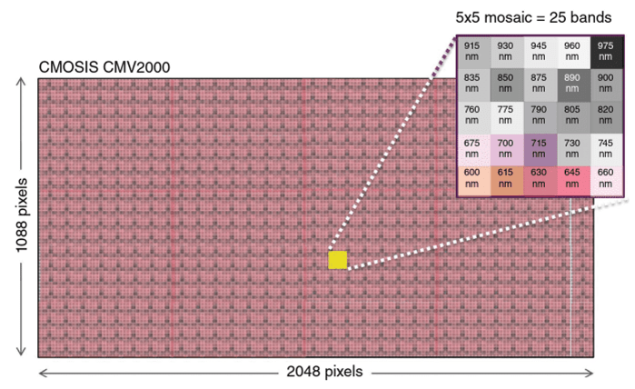
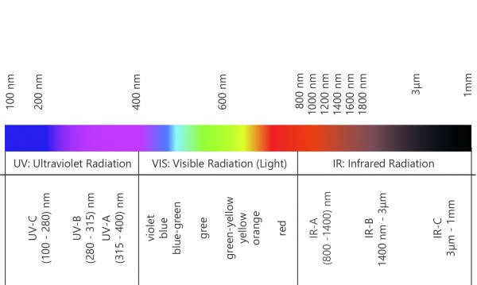
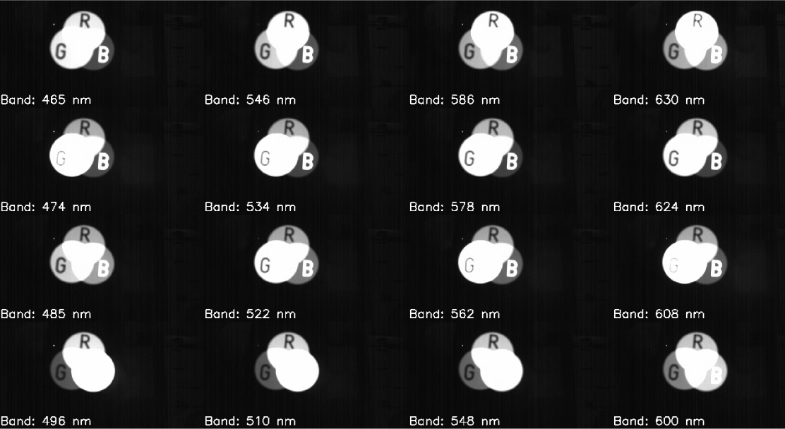

<div align="center">

# AIRLab PhotonFocus ROS 2 Driver
  
| Logo                                  | Description                                                                                                                                                                                                                                                                                                                   |
|---------------------------------------|-------------------------------------------------------------------------------------------------------------------------------------------------------------------------------------------------------------------------------------------------------------------------------------------------------------------------------|
|  | The AIRLab ROS 2 Driver is designed to read the image stream from PhotonFocus ® cameras using the eBUS SDK ®. As indicated by the logo, this library’s primary objective is to facilitate communication with hyper-spectral cameras (both NIR and VIS) manufactured by PhotonFocus ®, specifically for agricultural purposes. |

</div>

## Requirements
1. NVIDIA Jetson Xavier ® with Jetpack SDK 5.1 on Ubuntu 20.04 [[link](https://developer.nvidia.com/embedded/jetpack-sdk-51)]
2. ROS 2 Foxy [[link](https://docs.ros.org/en/foxy/Installation.html)]
3. OpenCV [[link](https://opencv.org/)]
4. eBUS SDK 6.3.1 ® for ARM-based architectures [[link](https://www.jai.com/uploads/documents/Software/SDK-eBUS/Ubuntu-Jetson/eBUS_SDK_JAI_Jetson_5.1_linux-aarch64-arm-6.3.1-6545.zip)]
5. PhotonFocus ® hyper-spectral cameras: 
   + **PhotonFocus VIS** MV1-D2048x1088-HS03-96-G2-10; Max resolution: 2048 x 1088; [[link](https://www.photonfocus.com/products/camerafinder/camera/mv1-d2048x1088-96-g2/)]
   + **PhotonFocus NIR** MV1-D2048x1088-HS02-96-G2-10; Max resolution: 2048 x 1088; [[link](https://www.photonfocus.com/products/camerafinder/camera/mv1-d2048x1088-96-g2/)]

## Usage
### Building
Open a terminal and follow the standard procedure for ROS 2 packages:
```
source /opt/ros/foxy/setup.bash
cd ros2_ws/src && git clone https://github.com/AIRLab-POLIMI/airlab-photonfocus-ros2-driver.git
cd .. && colcon build
source install/setup.bash
ros2 launch airlab-photonfocus-ros2-driver nir_launch.py
```

### VIS Camera launch
```
ros2 launch airlab-photonfocus-ros2-driver vis.launch.py
```

### NIR Camera launch
```
ros2 launch airlab-photonfocus-ros2-driver nir.launch.py
```

### VIS and NIR Camera launch
```
ros2 launch airlab-photonfocus-ros2-driver nir_vis.launch.py
```

### Automatic Exposure Time ROS 2 service
Take the Calibration Board, named "*Diffuse Reflectance Standard Calibration Target Package (V2)*", and place it __exactly__ in front-center of the camera:


Then, call the service to set the exposure time automatically:
```
# Average wavelength of the reflectance standard target package for the VIS camera
ros2 service call /vis/auto_exposure airlab_photonfocus_ros2_driver/srv/AutoExposure "{wavelength: 0}"

# Average wavelength of the reflectance standard target package for the NIR camera
ros2 service call /nir/auto_exposure airlab_photonfocus_ros2_driver/srv/AutoExposure "{wavelength: 0}"
```

Otherwise, you can set the exposure time according to the desired wavelength:
```
# Set the exposure time for the VIS camera at 550 nm
ros2 service call /vis/auto_exposure airlab_photonfocus_ros2_driver/srv/AutoExposure "{wavelength: 550}"

# Set the exposure time for the NIR camera at 700 nm
ros2 service call /nir/auto_exposure airlab_photonfocus_ros2_driver/srv/AutoExposure "{wavelength: 700}"
```

The ros2 service will return and set the optimized exposure time, based on the declared reflectance standard target package:


- **White**: 83% diffuse reflectance;
- **Light Grey**: 27% diffuse reflectance;
- **Dark Grey**: 22% diffuse reflectance;
- **Black**: 2% diffuse reflectance.

*NB. Diffuse reflectance is preferred to total reflectance in agricultural applications, as it is more representative of the actual reflectance of the target.*

### Automatic Exposure Time Pseudo-Algorithm
```
# Compute the correlation and chi-square distance
hist_correl = cv2.compareHist(hist_ref, hist, cv2.HISTCMP_CORREL)
hist_chi_square = cv2.compareHist(hist_ref, hist, cv2.HISTCMP_CHISQR)

# Sum the two distances inner-normalized
tot_cost_to_minimize = hist_correl.normalized() + hist_chi_square.normalized()

# Find the minimum cost, thus return the corresponding exposure time
best_cost = argmnin(tot_cost_to_minimize)
```

The objective function is a combination of the correlation and chi-square distance, which are inner-normalized and summed, since empirical results stated a better robustness. The minimum cost is found, and the corresponding exposure time is returned.

<div align="center">

</div>

### Prisma Post-Processing launch
```
ros2 launch airlab-photonfocus-ros2-driver prisma.launch.py
```
#### Prisma working mechanism based on CMOSIS CMV2000 sensor
- **VIS camera MV1-D2048x1088-HS03-96-G2**: it implements a multi-spectral area sensor with a 4x4 pixel pattern in the visible range. The spectral range from 470nm to 620nm is covered in 10 nm steps. The results is a collection of 16 simultaneous images 512x272 pixels each.
- **NIR camera MV1-D2048x1088-HS02-96-G2**: it implements a multi-spectral area sensor with a 5x5 pixel pattern in the NIR range. The spectral range from 600nm to 975nm is covered in 15.6 nm steps. The results is a collection of 25 simultaneous images 409x217 pixels each (a padding of 3 is added to the Y axis to match the VIS camera resolution, from 2048x1088 to 2045x1085).

In order to capture in real-time the spectral information, the Prisma post-processing algorithm is implemented. The Prisma algorithm is based on the encoding mosaic-pattern mechanism as declared:



The encoding pattern mechanism is based on the CMOSIS CMV2000 sensor, which is a 2.2 MPixel CMOS image sensor with a global shutter. The sensor has a 2048 x 1088 pixel array and is capable of operating at up to 340 frames per second. The sensor has 12-bit pixel depth and can be programmed to output data in either raw RGB or YUV format. The sensor has a 2-wire serial interface for programming the registers and a 4-wire interface for data output. The sensor has a 10-bit LVDS interface for high-speed data output:
- **CMV2K-SM5x5-NIR**: exhibits a mosaic configuration of the same format array of Fabry-Perot filters. In this configuration, a block of 5 x 5 detector pixels is integrated with 5x5 different Fabry-Perot filters on.
- **CMV2K-SM4x4-VIS**: exhibits a mosaic configuration of the same format array of Fabry-Perot filters. In this configuration, a block of 4 x 4 detector pixels is integrated with 4x4 different Fabry-Perot filters on.

An example of the first encoding is depicted in the following image:

<div align="center">

</div>
<div align="center">

</div>

The following bands in nm are decomposed:
- **VIS**: `465, 546, 586, 630, 474, 534, 578, 624, 485, 522, 562, 608, 496, 510, 548, 600`
- **NIR**: `915, 930, 945, 960, 975, 835, 850, 875, 890, 900, 760, 775, 790, 805, 820, 675, 700, 715, 730, 745, 600, 615, 630, 645, 660`

<div align="center">

</div>

### Results
VIS prisma decomposition:
<div align="center">

</div>

### Notes
- Requirements can be easily re-adapted also to NVIDIA Jetson Orin ® with Jetpack SDK 6.0 on Ubuntu 22.04, although **never** tested.
- Requirements can be easily re-adapted also for other PhotonFocus cameras based on the eBUS SDK standard GigE (or even US3).

## Acknowledgements
The Artificial Intelligence and Robotics Laboratory (AIRLab) @ Politecnico di Milano, provided support for this work. 
We extend our heartfelt gratitude to Alberto Invernizzi and the team at IRA Lab, Bicocca University of Milan, for their contribution in making their driver in ROS 1 open source. [[ROS 1 Driver](https://github.com/iralabdisco/ira_photonfocus_driver)]

## Authors
- Mirko Usuelli, PhD Candidate @ AIRLab, Politecnico di Milano [[LinkedIn](https://www.linkedin.com/in/mirko-usuelli-64992b155/)][[GitHub](https://github.com/mirkousuelli)]

## Laboratory
- [LinkedIn](https://it.linkedin.com/company/airlab-polimi) : Academic news
- [Instagram](https://www.instagram.com/airlab_polimi/) : Student news
