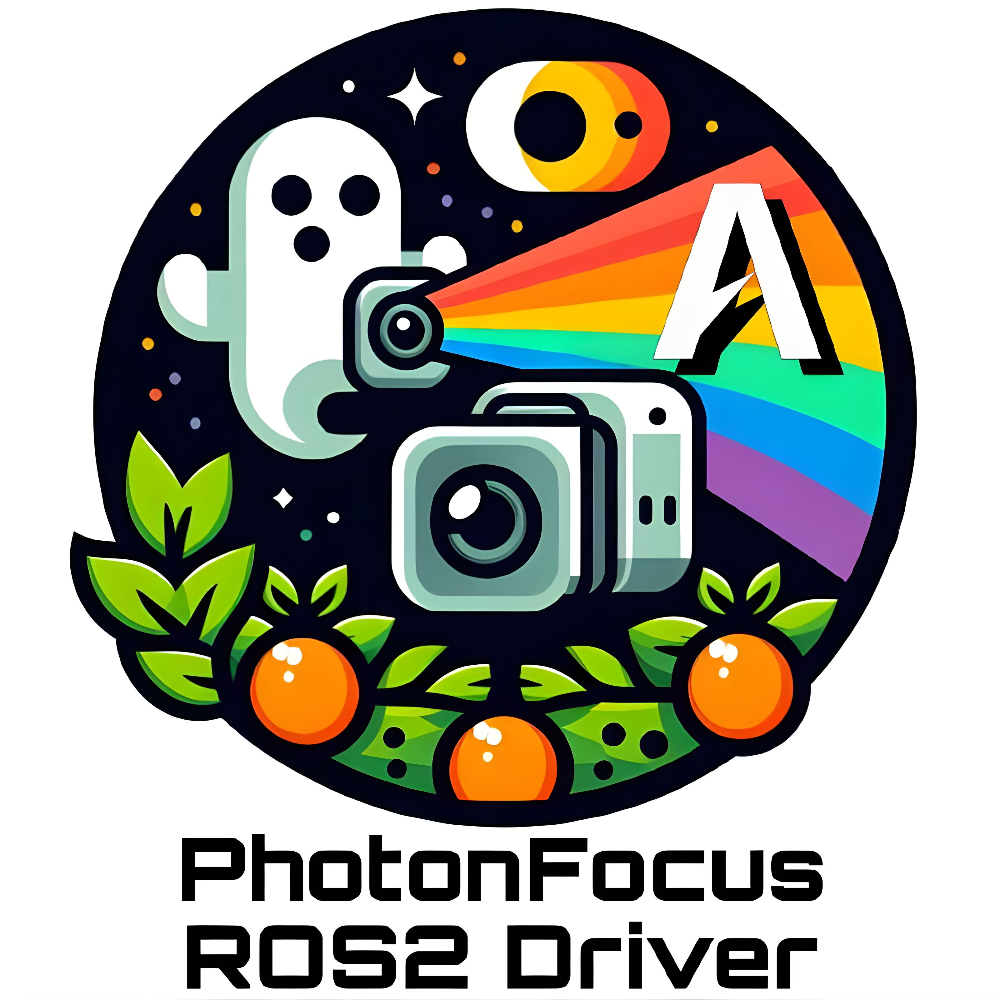

# AIRLab PhotonFocus ROS 2 Driver
  
| Logo                                  | Description                                                                                                                                                                                                                                                                                                                   |
|---------------------------------------|-------------------------------------------------------------------------------------------------------------------------------------------------------------------------------------------------------------------------------------------------------------------------------------------------------------------------------|
|  | The AIRLab ROS 2 Driver is designed to read the image stream from PhotonFocus ® cameras using the eBUS SDK ®. As indicated by the logo, this library’s primary objective is to facilitate communication with hyper-spectral cameras (both NIR and VIS) manufactured by PhotonFocus ®, specifically for agricultural purposes. |

## Requirements
1. NVIDIA Jetson Xavier ® with Jetpack SDK 5.1 on Ubuntu 20.04 [link](https://developer.nvidia.com/embedded/jetpack-sdk-51)
2. ROS 2 Foxy [link](https://docs.ros.org/en/foxy/Installation.html)
3. OpenCV [link](https://opencv.org/)
4. eBUS SDK 6.3.1 ® for ARM-based architectures [link](https://www.jai.com/uploads/documents/Software/SDK-eBUS/Ubuntu-Jetson/eBUS_SDK_JAI_Jetson_5.1_linux-aarch64-arm-6.3.1-6545.zip)
5. PhotonFocus ® hyper-spectral cameras: 
   + **PhotonFocus VIS** MV1-D2048x1088-HS03-96-G2-10; Max resolution: 2048 x 1088; [link](https://www.photonfocus.com/products/camerafinder/camera/mv1-d2048x1088-96-g2/)
   + **PhotonFocus NIR** MV1-D2048x1088-HS02-96-G2-10; Max resolution: 2048 x 1088; [link](https://www.photonfocus.com/products/camerafinder/camera/mv1-d2048x1088-96-g2/)

## Usage
Open a terminal and follow the standard procedure for ROS 2 packages:
1. `source opt/ros/foxy/setup.bash`
2. `cd ros2_ws/src && git clone https://github.com/AIRLab-POLIMI/airlab-photonfocus-ros2-wrapper`
3. `cd .. && colcon build`
4. `source install/setup.bash`
5. `ros2 launch airlab-photonfocus-ros2-wrapper nir_launch.py`

### Notes
- Requirements can be easily re-adapted also to NVIDIA Jetson Orin ® with Jetpack SDK 6.0 on Ubuntu 22.04, although **never** tested.
- Requirements can be easily re-adapted also for other PhotonFocus cameras based on the eBUS SDK standard GigE (or even US3).

## Acknowledgements
The Artificial Intelligence and Robotics Laboratory (AIRLab) @ Politecnico di Milano, provided support for this work. 
We extend our heartfelt gratitude to Alberto Invernizzi and the team at IRA Lab, Bicocca University of Milan, for their contribution in making their driver in ROS 1 open source. [link](https://github.com/iralabdisco/ira_photonfocus_driver)

## Authors
- Mirko Usuelli, PhD Candidate @ AIRLab, Politecnico di Milano [link](https://www.linkedin.com/in/mirko-usuelli-64992b155/)
